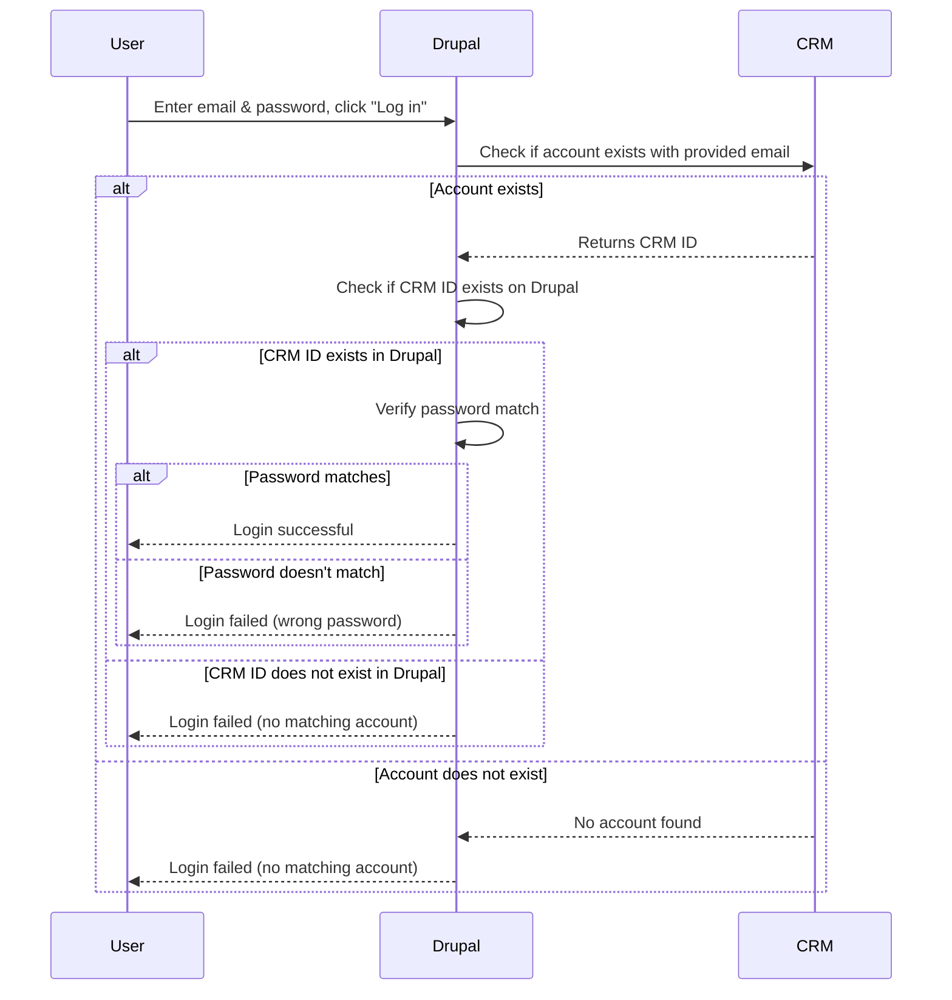

# Drupal External Authentication

```mermaid
sequenceDiagram
    participant User
    participant Drupal
    participant CRM

    User->>Drupal: Enter email & password, click "Log in"
    Drupal->>CRM: Check if account exists with provided email
    alt Account exists
        CRM-->>Drupal: Returns CRM ID
        Drupal->>Drupal: Check if CRM ID exists on Drupal
        alt CRM ID exists in Drupal
            Drupal->>Drupal: Verify password match
            alt Password matches
                Drupal-->>User: Login successful
            else Password doesn't match
                Drupal-->>User: Login failed (wrong password)
            end
        else CRM ID does not exist in Drupal
            Drupal-->>User: Login failed (no matching account)
        end
    else Account does not exist
        CRM-->>Drupal: No account found
        Drupal-->>User: Login failed (no matching account)
    end
```
